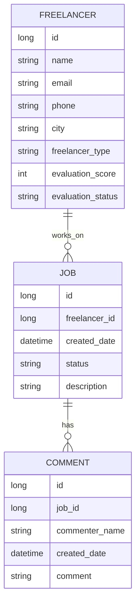

# Presentation Assets

This page contains visual and concrete examples for stakeholder presentations.

## 1) RESTful API Shape (Presentation Slide)

- Base path: `/api/v1`
- Resource-oriented URLs:
  - `/freelancers`
  - `/jobs`
  - `/comments`
- Relationship URLs:
  - `/freelancers/{freelancerId}/jobs`
  - `/jobs/{jobId}/comments`
- Method semantics:
  - `POST` create
  - `GET` retrieve
  - `PATCH` update selected fields
- Planned status codes:
  - `201` create success
  - `200` read/update success
  - `400/404/409` error classes

## 2) High-Level Data Relation Diagram



## 3) Sample API #1 - Create Freelancer

Endpoint: `POST /api/v1/freelancers`

Request example:

```json
{
  "name": "Ayse Demir",
  "email": "ayse.demir@example.com",
  "phone": "+90-555-000-1122",
  "city": "Istanbul",
  "freelancerType": "SOFTWARE_DEVELOPER",
  "softwareLanguages": ["Java", "Go"],
  "specialties": ["Backend", "Microservices"],
  "additionalFields": {
    "github": "https://github.com/aysedemir"
  }
}
```

Response example:

```json
{
  "id": 101,
  "name": "Ayse Demir",
  "email": "ayse.demir@example.com",
  "city": "Istanbul",
  "freelancerType": "SOFTWARE_DEVELOPER",
  "evaluationStatus": "PENDING",
  "evaluationScore": null
}
```

## 4) Sample API #2 - Search Freelancers

Endpoint: `GET /api/v1/freelancers/search?city=Istanbul&type=SOFTWARE_DEVELOPER&specialty=Backend`

Response example:

```json
{
  "items": [
    {
      "id": 101,
      "name": "Ayse Demir",
      "city": "Istanbul",
      "freelancerType": "SOFTWARE_DEVELOPER",
      "softwareLanguages": ["Java", "Go"],
      "specialties": ["Backend", "Microservices"],
      "evaluationStatus": "COMPLETED",
      "evaluationScore": 4
    }
  ],
  "total": 1
}
```

## Talking Point for Stakeholders

This design keeps scope focused on requested backend capabilities while leaving room for future extensions after the first delivery.
